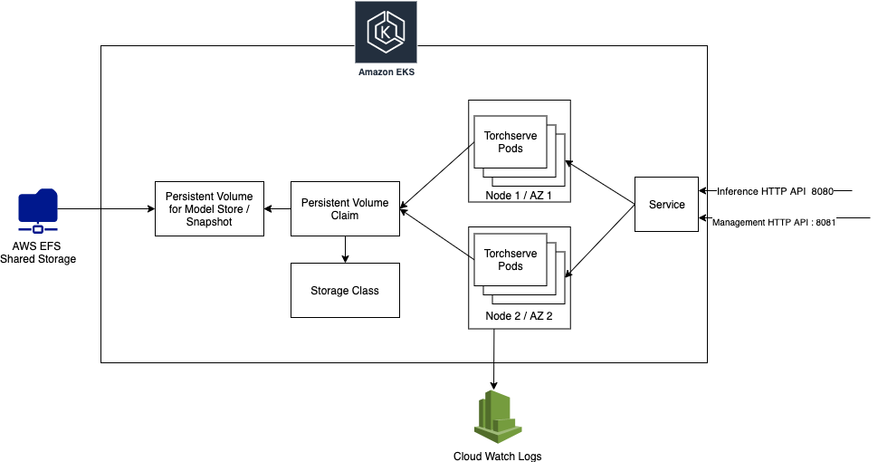

## Torchserve on Kubernetes

## Overview

This page demonstrates a Torchserve deployment in Kubernetes using Helm Charts. Its uses [DockerHub Torchserve Image](https://hub.docker.com/r/pytorch/torchserve) for the deployment. This deployment leverages a PersistentVolume for storing snapshot / model files which are shared between multiple pods of the torchserve deployment.



In the following sections we would 
* Create a EKS Cluster for deploying Torchserve
* Create a PersistentVolume backed by EFS to store models and config
* Use Helm charts to deploy Torchserve

## Prerequisites

We would need the following tools to be installed to setup the K8S Torchserve cluster.

* AWS CLI - [Installation](https://docs.aws.amazon.com/cli/latest/userguide/install-cliv2-linux.html)
* eksctl - [Installation](https://docs.aws.amazon.com/eks/latest/userguide/getting-started-eksctl.html)
* kubectl - [Installation](https://kubernetes.io/docs/tasks/tools/install-kubectl/)
* helm - [Installation](https://helm.sh/docs/intro/install/)

## EKS Cluster setup

Is you have an existing EKS / Kubernetes cluster you may skip this section and skip ahead to driver installation. Ensure you have your AWS CLI configured with the credentials of an account with appropriate permissions. 

The following steps would create a EKS cluster, install all the required driver for NVIDIA GPU, EFS.


### Creating a EKS cluster

**EKS Optimized AMI Subscription**

First subscribe to EKS-optimized AMI with GPU Support in the AWS Marketplace. Subscribe [here](https://aws.amazon.com/marketplace/pp/B07GRHFXGM). These hosts would be used for the EKS Node Group. 

**Create a EKS Cluster**

To create a cluster run the following command. 

```eksctl create cluster -f templates/eks_cluster.yaml```

This would create a EKS cluster named **TorchserveCluster**

**NVIDIA Plugin**

The NVIDIA device plugin for Kubernetes is a Daemonset that allows you to run GPU enabled containers. The instauctions for installing the plugin can be found [here](https://github.com/NVIDIA/k8s-device-plugin#installing-via-helm-installfrom-the-nvidia-device-plugin-helm-repository)

```
helm repo add nvdp https://nvidia.github.io/k8s-device-plugin
helm repo update
helm install \
    --version=0.6.0 \
    --generate-name \
    nvdp/nvidia-device-plugin
```

## EFS Backed Model Store Setup

This section describes steps to prepare a PersistentVolume that would be used by the TS Helm Chart.

For this example we use a PersistentVolumes backed by EFS to store the MAR files and Torchserve config that would be shared by all the TorchServe Pods. The PersistentVolumeClaim of the Deployment can be fulfilled by any Distributed Strorage backed PersistentVolume.

To prepare a EFS volume as a shared model / config store we

1. Create a EFS file system. 
2. Create a Security Group, Ingress rule to enable EFS communicate across NAT of the EKS cluster
3. Copy the Torchserve MAR files / Config files to a predefined directory structure.

Bulk of the heavy lifting for these steps is performed by ``setup_efs.sh`` script. 

This script would 

* Creete a EFS File system
* Create a Security Group, Ingress rule to enable EFS communicate across NAT of the EKS cluster
* Boootup an EC2 host and attach the EFS Filesystem

Finally we would copy the MAR files / Config files to the EFS mounted by the EFS.

To run the script, Update the following variables in `setup_efs.sh`


    CLUSTER_NAME=TorchserveCluster # EKS TS Cluser Name
    MOUNT_TARGET_GROUP_NAME="eks-efs-group"
    SECURITY_GROUP_NAME="ec2-instance-group"
    EC2_KEY_NAME="machine-learning" # This can be an existing keypair that you already have in the region.

Then run `./setup_efs.sh`

Upon completion of the script, SSH into the EC2 host, mount the EFS filesystem and create the following directory structure which would be used the Torchserve Pods.

    EFS_FILE_SYSTEM_DNS_NAME=file-system-id.efs.aws-region.amazonaws.com # Update file-system-id & aws-region
    sudo mkdir efs-mount-point
    sudo mount -t nfs -o nfsvers=4.1,rsize=1048576,wsize=1048576,hard,timeo=600,retrans=2,noresvport \
    $EFS_FILE_SYSTEM_DNS_NAME:/ efs-mount-point
    cd efs-mount-point
    sudo mkdir data

Finally copy the MAR files / Config files in to the data folder

    cd data
    sudo mkdir model_store
    cd model_store
    wget 
    cd -
    mkdir config
    cd config
    
Copy the following contents in to a file called config.yaml in to the directory

    inference_address=http://0.0.0.0:8080
    management_address=http://0.0.0.0:8081
    NUM_WORKERS=1
    number_of_gpu=1
    number_of_netty_threads=32
    job_queue_size=1000
    model_store=/home/model-server/model-store
    model_snapshot={"name":"startup.cfg","modelCount":1,"models":{"squeezenet1_1":{"1.0":{"defaultVersion":true,"marName":"squeezenet1_1.mar","minWorkers":3,"maxWorkers":3,"batchSize":1,"maxBatchDelay":100,"responseTimeout":120}}}}

Finally terminate the EC2 instance.


## Deploy TorchServe using Helm Charts


| Parameter | Description | Default |
|-----------|-------------|---------|
| `image` | Torchserve Serving image | `pytorch/torchserve:latest-gpu` |
| `management-port` | TS Inference port | `8080` |
| `inference-port` | TS Management port | `8081` |
| `config` | Torchserve config with snapshot info  | `LoadBalancer` |
| `replicas`| K8S deployment replicas | `1` |
| `model-store`| EFS mountpath | `/home/model-server/model-store` |
| `persistence.size`| Storage size to request | `5Gi` |


#### Test Torchserve installation in k8s

## Roadmap
* [] Autoscaling
* [] Log Aggregation
* [] Metrics Aggregation
* [] EFK Stack Integration
* [] Readiness / Liveness Probes
* [] Canary
* [] Cloud agnostic Distributed Storage

## Troubleshooting

### Other Resources

* https://www.eksworkshop.com/beginner/190_efs/setting-up-efs/ 
* https://aws.amazon.com/premiumsupport/knowledge-center/eks-persistent-storage/
